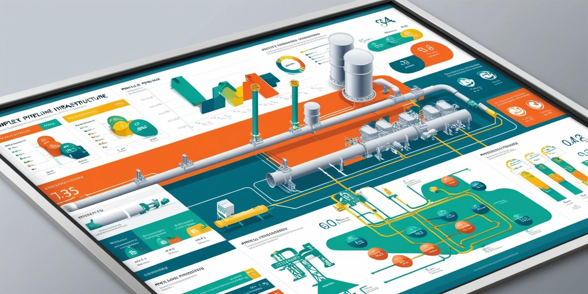

# Automate Asset Management and Anomaly Detection with AI Workflow Solutions for Enterprise and SMEs
---
### Empowering teams to monitor, manage, and resolve issues with speed and precision—no extra staff needed.

### Overview

Introduction:
>Transform how your team manages physical assets across industries with Workmate’s Smart Alerting and Case Management. From real-time monitoring to intelligent anomaly detection and case handling, our AI workflow automation platform streamlines asset management for upstream, midstream, and downstream sectors. Designed to integrate with existing infrastructure, Workmate enables enterprises and SMEs to address issues more efficiently, without increasing personnel.

### Core Feature

1. **Real-time Data Streaming**
   >Stream sensor data in near real-time from SCADA systems, OSI Pi historians, and unstructured data sources like maintenance logs and equipment blueprints. Automatically process this information into actionable insights, empowering rapid response.
2. **Advanced Sensor Analytics**
   >Leverage time-series data analytics for immediate insights and historical analysis. Build customized dashboards with just a few clicks—whether your data spans sub-second intervals or decades. Workmate’s efficient visualization tools adapt seamlessly to any scale.

3. **Smart Alerting**
   >With natural language, set alerts for anomalies—such as ‘notify when compressor inlet pressure rises by 20% above its 30-day average.’ AI-driven logic enables prompt, automated responses to potential issues, minimizing downtime.

4. **Intuitive Case Management**
   >Workmate’s Case Management system consolidates procedures, SOPs, and user feedback to assist in quick root cause analysis. Suggested solutions help operators resolve issues efficiently, enhancing process reliability across the board.

5. **Automated Summarization**
   >Reduce communication lag with AI-generated summaries that streamline reporting for engineers and maintenance teams. Automated summaries ensure rapid, clear understanding of issues and foster a proactive approach to issue prevention.
---
## Benefits for Enterprise and SME Clients

- Enhanced Efficiency: Manage high volumes of issues without increasing headcount.
- Data-Driven Insights: Real-time, historical, and predictive analytics keep your team informed.
- Scalable for All Businesses: Workmate’s solutions are designed to grow with your business, ensuring both small teams and large enterprises can benefit.
