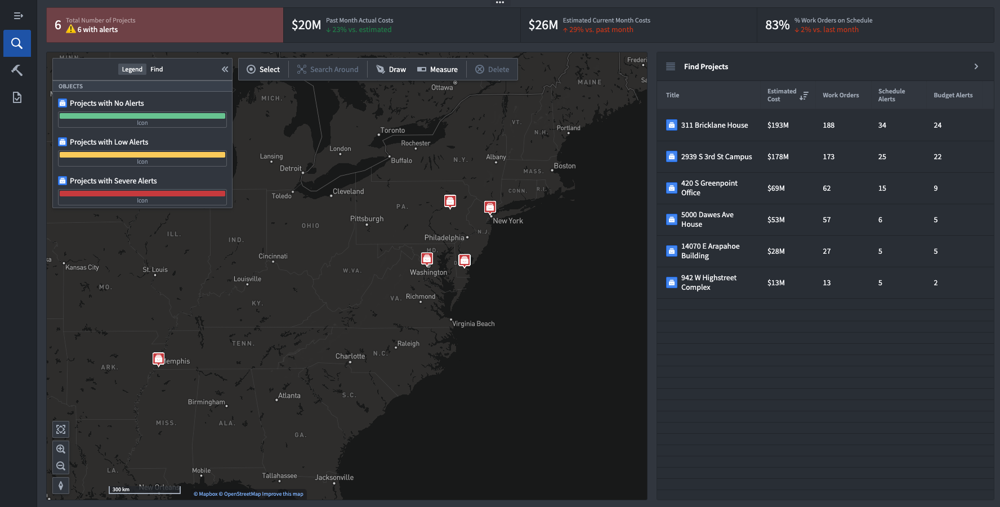

# Workmate Connected Construction Command Center

Elevate your construction project management with a single platform that integrates schedules designs, and financials. Experience the power of AI with real-time updates, predictive planning, and smart automations that enhance your strategic decision-making.
## Overview
Workmate Connected Construction Command Center provides a unified view of your construction projects, merging critical aspects like schedules, designs, and budgets into a user-friendly interface. Designed specifically for the construction industry's unique needs, it enables flexible and efficient project management.

With the integration of Building Information Modeling (BIM) and Work Orders, the application offers a series of dynamic and interconnected workflows for teams focused on the full spectrum of construction, from planning to execution.

Compatible with industry-leading systems such as Primavera P6, IBM Maximo, Procore, Autodesk, and various ERPs, Workmate bootstraps structured and unstructured data and makes it available for any given workflow, boosting project efficiency and overall value.

## Key Features:

- **Bespoke Digital Twin for Construction Projects:** Workmate seamlessly merges unstructured data and paper documents (including Primavera P6, IBM Maximo, Procore, Autodesk, and various ERPs), into a centralized Ontology for construction sites.
- **Construction Control Tower:** Users have a comprehensive, bird's-eye view of all projects, enabling configurable alerts for real-time tracking based on critical path elements such as schedules, budgets, and work order dependencies.
- **Decision Empowerment:** Dive into key project components with flexible tools designed for collaboration between project site and      planning teams:

  - **Design Review:** Navigate engineering schematics with precision.
  - **Integrated Critical Path and Long-Term Scheduling:** Adapt project timelines responsively.
  - **Budget Oversight:** Manage invoices and procurement efficiently.
  - **Material Sourcing:** Optimize and proactively manage dependencies on supplies relative to shifting project plans.