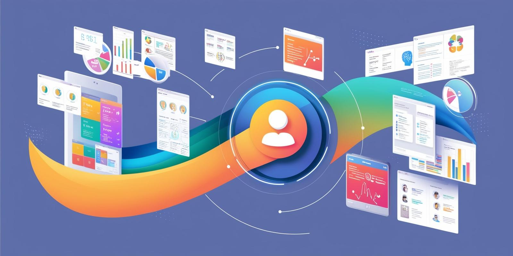
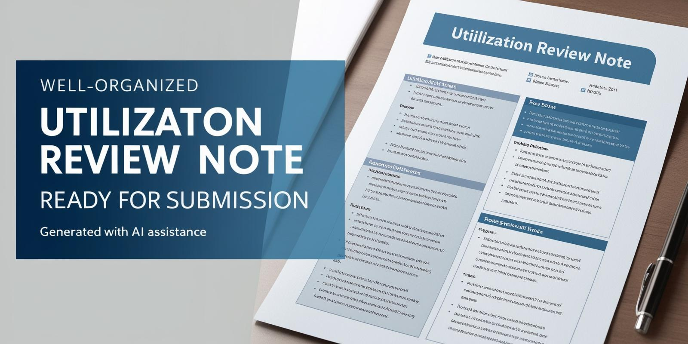

# AI-Powered Patient Insights and Automated Workflow Solutions for Case Management in Healthcare

Harnessing the power of AI, our platform brings together a seamless solution for healthcare providers to optimize patient chart reviews and automate complex workflow tasks. Designed for both large healthcare enterprises and SME clinics, this platform helps case managers effortlessly review clinical data, extract essential insights, and create high-quality, compliant utilization reviews. With features that enhance understanding and efficiency, our platform empowers healthcare teams to deliver informed, patient-centric care.

## Features

1. **Multimodal Clinical Data Integration**
   >Start with raw, multimodal clinical data collected from various sources to create a unified patient profile over time. Our platform integrates text, images, and time-series data to form a cohesive view of each patient, supporting more accurate decision-making.

2. **Conversational Data Analysis**
   >Answer complex, natural language questions about the patient's history, treatments, and outcomes. The platform leverages generative AI to provide insightful, contextual answers with references to specific data sources, enhancing the case manager's confidence in each response.{image_here}

3. **Intelligent Chart Review**
   >With AI-driven chart review capabilities, case managers can quickly identify relevant clinical information, such as abnormal lab results, comorbidities, and risk factors. This feature streamlines chart navigation by highlighting critical data points, which improves the speed and accuracy of care assessments.
4. **Relevant Evidence Extraction**
   >Our AI platform enables case managers to tailor evidence extraction based on specific criteria like care guidelines, diagnosis requirements, and payer rules. This feature ensures that utilization reviews align with regulatory standards, increasing the chances of claim approvals.

5. **Utilization Review Drafting**
   >AI-assisted note composition helps case managers craft comprehensive, high-quality utilization review notes that highlight the most pertinent details of the patient's chart. The generated notes are easily customizable and ready for verification, reducing the time and effort required for insurance submissions.