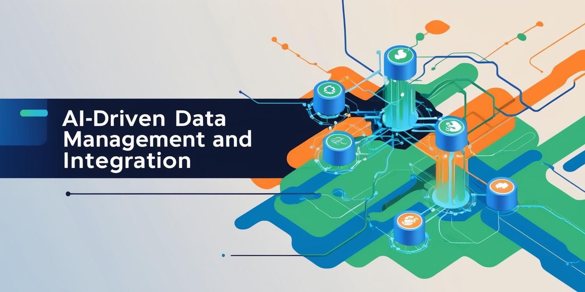

# AI-Powered Portfolio Management for Private Equity

Experience transformative investment management with our AI-Powered Portfolio Manager tailored for the private equity sector. This robust solution enables firms to harness 360° insights, automate complex reporting, and enhance decision-making with customizable, AI-driven applications. Designed for enterprises and SMEs, this platform streamlines oversight and simplifies data handling for both general and limited partners, supporting seamless integration and powerful analytics.

### Overview
Our AI-Powered Portfolio Manager for Private Equity is an advanced solution built to unify disparate data sources into a cohesive, private equity-focused framework. The platform consolidates CRMs, financial databases like Preqin, third-party resources, and open-source data to ensure a single, streamlined view of portfolio health and performance.

Through standardized data ontology, the platform harmonizes different data formats, providing a comprehensive view of each investment. Its intuitive interface is fully customizable to meet each firm’s specific needs, allowing for easy creation of personalized outputs such as tear sheets, internal analyses, and detailed reports for Limited Partners (LPs).

### Key Features:
- **AI-Driven Data Management & Integration**
  >Effortlessly manage and normalize data from a wide array of sources. AIP leverages AI for high data quality, with built-in validation and governance controls that ensure accuracy. Gen AI techniques support data extraction and reduce inconsistencies, bringing a new level of reliability to investment data.
- **Comprehensive Investment Ontology**
  >Create a structured, adaptable data framework that enhances portfolio monitoring, reporting, and analytics. This ontology is accessible within the platform and easily exportable to Excel or other systems, allowing for effective data sharing across teams. Permission settings can be tailored to control access, enabling secure collaboration.
- **Customizable AI-Driven Applications**
  >Use pre-built or tailored applications to automate reporting, disclosure management, and memo creation. These workflows are designed for one-click deployment, making them adaptable to the unique needs of general partners or directly accessible to limited partners via bespoke interfaces.
- **Flexible Modelling & Analytics Tools**
  >Build new metrics, forecasts, valuation models, and more with low-code development tools. This flexibility allows firms to adapt quickly to evolving market conditions or changing investment strategies, giving teams the ability to innovate and drive better portfolio performance.
