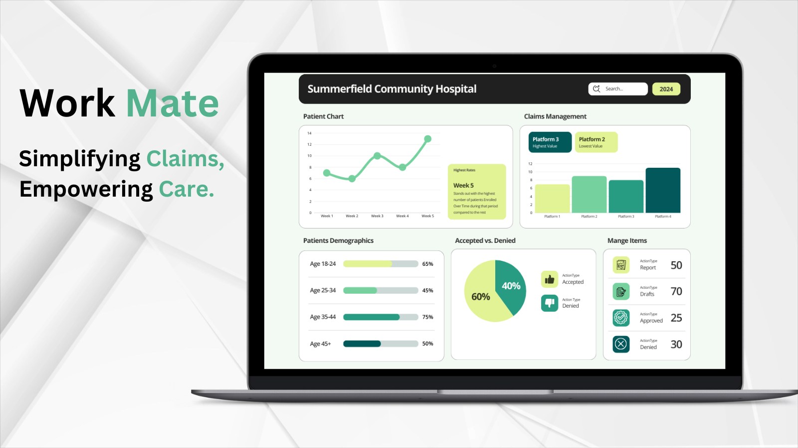

# AI-Powered Workflow Automation for Hospital Claims & Denials Management

Effortlessly streamline hospital appeals by automating claims analysis, evidence extraction from patient charts, and drafting appeal letters tailored to insurance guidelines. Designed for hospitals to reduce claim denials, Workmate brings intelligent automation to healthcare workflows.

### Overview

Hospital Case Managers leverage Workmate’s AI-driven automation to analyze patient charts, verify documentation, and generate claims documentation optimized for approval by insurance companies. Workmate’s comprehensive support helps streamline the administrative workload by automating documentation processes and assisting in the generation of evidence-backed utilization reviews.

From patient admission through the duration of care, Workmate assists Case Managers by drafting utilization review notes and highlighting relevant patient information, minimizing the risk of denials due to inadequate documentation. This approach not only optimizes the claims appeal process but also provides ongoing support for patient care validation, allowing staff to focus on patient outcomes.

---

### Key Features

- **Automated Chart Analysis:** 
  >Workmate simplifies chart reviews, automatically flagging important patient information—like abnormal lab results or comorbidities—relevant to the patient's level of care, enabling faster and more accurate documentation reviews.
- **Evidence Extraction:** 
  >Workmate enables Case Managers to customize evaluation criteria based on specific care guidelines and payer requirements, resulting in utilization reviews that meet insurer standards for approval.
- **Smart Utilization Review Writing:** 
  >Workmate assists Case Managers by drafting a comprehensive utilization review based on selected elements of a patient's chart. This draft can then be reviewed and sent to insurance providers, reducing the time spent on documentation and enhancing accuracy.

  ## Customer Benefits

  Workmate delivers unparalleled benefits to hospitals by enhancing efficiency, saving time, and reducing operational costs. Here's how it directly impacts your organization:

---
- **Improved Operational Efficiency**
    >By automating the labor-intensive processes of claims analysis and documentation, Workmate empowers hospital staff to focus on patient care rather than paperwork. Case Managers can now rely on AI to quickly analyze charts, flag critical information, and draft precise documentation—reducing the administrative burden and ensuring that no vital detail is overlooked.
- **Reduced Time Spent on Documentation**
   >Manual claims preparation often consumes hours of staff time, delaying submission and approval processes. Workmate’s smart drafting capabilities shorten this cycle dramatically. Its automation allows Case Managers to generate evidence-backed utilization reviews in minutes, accelerating claims submissions and reducing approval delays.
- **Lower Operational Costs**
   >With faster documentation processes and improved accuracy, hospitals experience fewer claim denials and the associated costs of rework and appeals. By reducing the need for extensive manual reviews and resubmissions, Workmate helps cut administrative overhead and ensures optimal resource allocation.
- **Enhanced Claim Approval Rates**
   >Workmate’s tailored approach to evidence extraction and chart analysis aligns with payer requirements, leading to more comprehensive and accurate documentation. This reduces the risk of denials and increases the likelihood of first-time approval, ensuring a steady revenue stream for hospitals.
- **Empowered Staff and Better Patient Outcomes**
  >By minimizing administrative burdens, hospital staff have more time and energy to dedicate to patient care. Workmate enables Case Managers to focus on critical decision-making and patient outcomes, ultimately enhancing the quality of care provided.

With Workmate, hospitals gain a reliable partner in navigating the complexities of claims and denials management, achieving higher efficiency, reduced costs, and better outcomes for both patients and providers.

