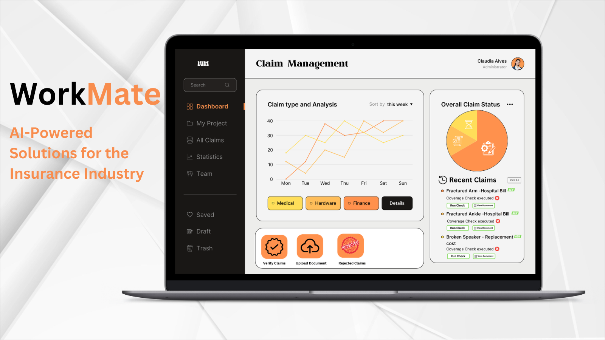

# Workmate Claims Coverage Engine

Workmate Claims Coverage Engine empowers insurance providers to provide accurate, consistent claim coverage assessments, leading to faster claim processing and improved customer satisfaction. By rapidly comparing claims against user-defined coverage conditions, Workmate offers a quick and accurate determination of coverage, enhancing efficiency and reducing operational costs.

## Overview 
Workmate rapidly accelerates the coverage review process by streamlining the evaluation of insurance claims against established coverage conditions, while simultaneously putting human-in-the-loop guardrails in place to enforce the ethical use of AI. With the ability to understand natural language descriptions and images, users can effortlessly modify the enforced conditions to fit their specific requirements. This accelerates the core operations of insurance companies, significantly reducing the time and expense associated with claim handling.

By harnessing Workmate, insurance providers can ensure more accurate, consistent claim coverage assessments, leading to faster claim processing and improved customer satisfaction. The system's adaptability allows for quick adjustments to coverage conditions, making it an indispensable tool for keeping pace with changing regulations and insurance products.

## Key Features:

- **Claims Ingestion:** Users can start immediately with a selection of notional customer claims or ingest their own claims to run through the customizable coverage engine.
- **Multimodal-AI-powered Review:** Workmate leverages multimodal AI to automatically assess incoming claims against pre-defined and customizable coverage conditions, ensuring a rapid and accurate determination of coverage eligibility.
- **Dynamic Reporting:** The system provides dynamic reporting features, allowing users to easily review and validate the results of the coverage checks for each claim. This transparency helps in making informed decisions and streamlining the claim coverage review process.
- **Ethical AI Guardrails:** Workmate automatically puts guardrails in place which make sure that the AI is never permitted to prevent the payout of a claim without a human confirming the correctness of its determinations.

Workmate for Insurance Coverage Checking Review represents a leap forward in insurance claim processing, offering a powerful tool for insurance companies aiming to enhance their operational efficiency and customer service quality.