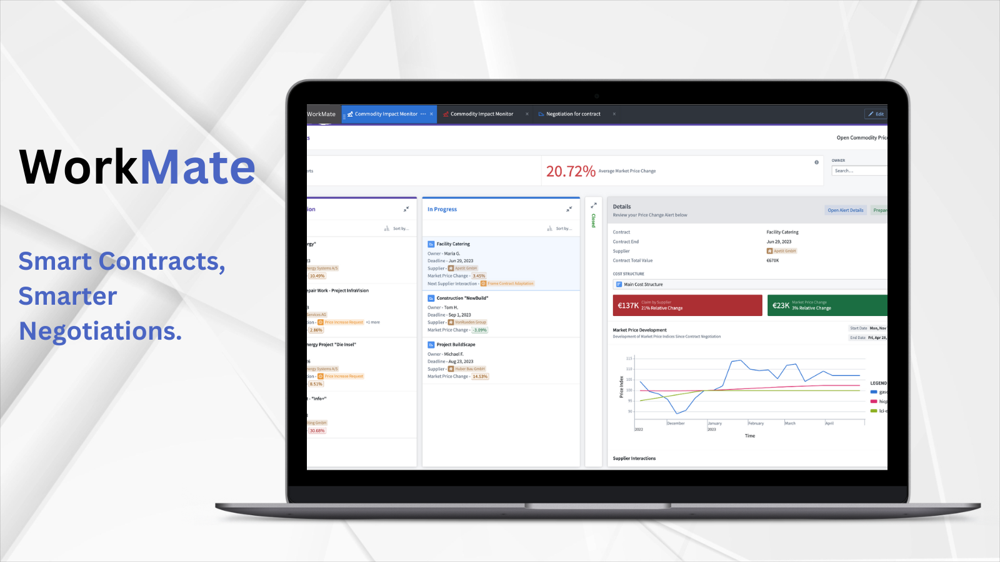

# Workmate for Contract Optimization & Compliance

Workmate helps contract negotiation teams to rapidly analyze and compare contracts.

## Overview
Workmate helps contract negotiation teams to analyze contracts and uncover shortcomings and possibilities within contracts. This allows users to surface strategic modifications to promote alignment with organizational objectives.

## Key Features:

- **Contract Version Analysis:** Easily analyze contract versions, identify clause edits, and assess their potential impact on the negotiation process.

- **Issue List Generation:** Automatically generate an issues list for review, enabling proactive mitigation and clause updates for human-in-the-loop review before sending the contract back to opposing counsel.

- **Configure to Any Contract:** Workmate adapts to various contract types, ensuring proper clause segmentation and tailored application.