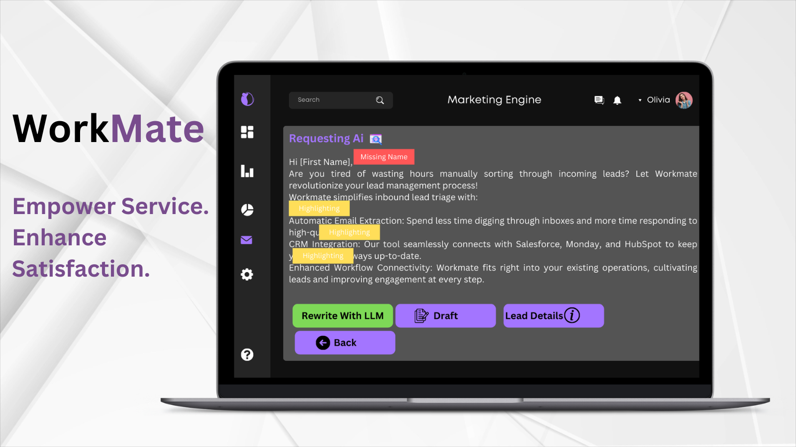

# Workmate Customer Service Engine

Workmate enables customer service teams to integrate consumer data with sales data to inform next best action for every customer.
## Overview
Workmate drives fast, personalized service by reasoning through customer cases (e.g, emails, feedback, or complaints) and creates responses using an ontology comprising of customer orders and their status, as well as the customer's historical sales and preferences.

## Key Features:

- **Customer 360:** A complete, actionable view of customer operations across the enterprise. A wide variety of native data connectors enable integration with CRMs such as Salesforce and HubSpot, marketing platforms including MailChimp and Marketo, and support platforms like Zendesk and ServiceNow.

- **AI-assisted customer communications:** Give your operators the ability to explore cases, approve AI-generated comms and send to end-customers. Operators can also edit AI responses, capturing valuable feedback in the Ontology that can inform future AI responses.

- **Evolving knowledge base:** The Customer Service Engine comes with a relevant base ontology with objects such as customer, order, case, and agent feedback. This ontology can be further configured to any organization’s specifications. Once plugged in with data connections, every campaign, communication and case is captured in the ontology to enhance interactions with end-customers.

- **Targeted feedback integration:** Both user and consumer feedback on AI-generated comms is captured with full traceability, allowing learnings to be captured and applied to future AI agent outputs.

- **Actionable insights:** Using LLMs to parse through large-scale unstructured customer feedback to create actionable insights for your business. This allows the ability to directly engage with customers at the individual support level, as well as campaign-level optimizations that can be actioned directly from Workmate and written back to tools such as MailChimp, Zoho and ActiveCampaign.