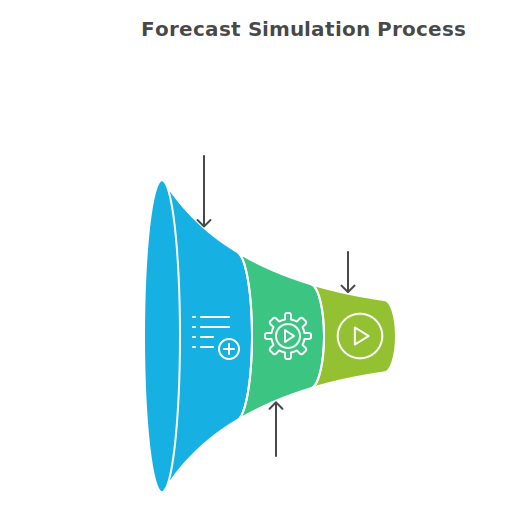

# Workmate for Demand Forecasting

The Demand Forecasting Dashboard is designed to help customers predict demand for their products and proactively plan for increases or decreases in demand. This is based on an advanced statistical model that runs on historical sales data. It also allows the user to input some known future variables such as future price or anticipated sell amount for a certain time period. It also allows the user to save more forecasts and have them all available in the app to compare and contrast.

## Overview 

Workmate enables teams to generate demand forecasts across the entire SKU base. The forecasting module enables multiple models to be run in parallel and compared to determine the best strategy for each SKU, leveraging both internal data, such as historical sales and inventory, and external data, such as weather patterns.

Beyond just a forward-looking forecast, Workmate helps planning teams highlight the relevant inputs to the forecast using what-if simulation. Users can then perform forecasts with natural-language prompts, such as "what if the weather is colder than expected next month?" or "what if I increase prices by 10%?". The user can use Workmate to then orchestrate the parameter changes to perform the simulation.

## Key Features

- **Live Demand Simulation:** Leverage model outputs, such as coefficients of correlation or confidence intervals to provide executives and planners with an easy-to-use simulation cockpit. With this feature, Workmate enables users to understand risks and opportunities with plenty of time to act on outputs.
- **Business-User Focused Interface:** Using low-code/no-code capabilities, Workmate can help non-technical business experts drive model iteration and validation against real data using their business experience.
- **Highly Configurable Modeling:** Workmate can help users implement forecasts that make sense for the business at a daily, weekly, monthly or yearly cadence across customers, SKUs and product lines.