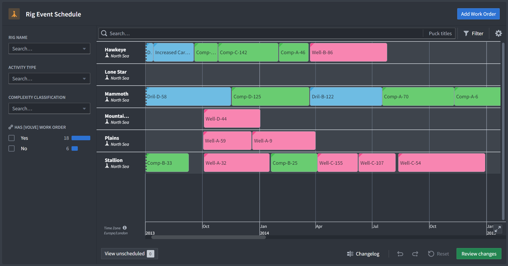

# Workmate for Dynamic Rig Scheduling

Create efficient schedules with optimal asset allocation that consistently meet production and capital targets while managing the complexity of rig operations.
## Overview
Efficient rig scheduling is critical for achieving production and cost targets in the constantly changing oil & gas industry. Workmate powers the Dynamic Rig Scheduling app to bring AI to scheduling and resource management for drilling, completions, and well work. It enables operations teams to effectively create and manage their schedules in the context of their organization and adapt to real-time changes to their environment. The app streamlines work order management, maintenance, and personnel allocation, optimizing asset utilization and enabling teams to quickly respond to evolving plans.

## Key Features:

- **Comprehensive rig scheduling:** Workmate integrates structured and unstructured data automatically to facilitate the organization of drilling, completions, and well work, ensuring production targets are met.
- **Activity and personnel management:** Drill down and schedule specific tasks, such as maintenance. Workmate suggests the assignment of personnel to those work orders for efficient workforce allocation based on certifications and current allocation.
- **AFE creation and approval process:** Supports the creation of Authorization for Expenditure (AFE) documents and streamlines the approval workflow, simplifying financial management. Automatically releases approved AFEs for Rig scheduling.
- **Schedule monitoring and improvement:** Provides timely notifications to planning teams about schedule adjustments and offers AI-driven recommendations for enhancing operational efficiency.