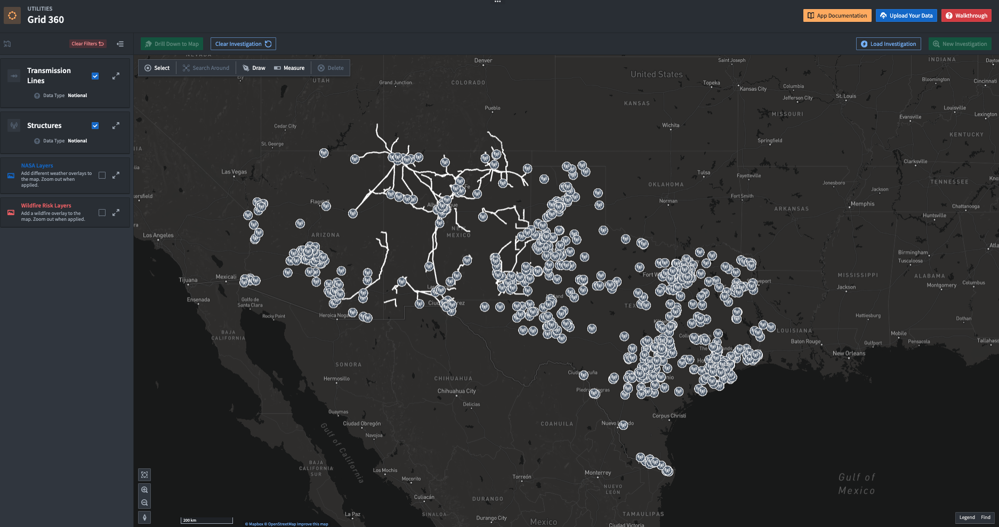

# Workmate for Grid Planning and Network Maintenance 

Gain full visibility into asset networks to optimize grid operations with Workmate. Utilities teams are able to leverage a geographic overview of the network, then drill down into single assets for real-time visibility.

## Overview
A building block for powerful operational workflows, Workmate for Grid Planning and Network Maintenance provides full visibility into an organizations' entire asset network. The offering enables comprehensive asset and risk planning by leveraging once siloed grid data and open source weather data, allowing Utilities companies to optimize their operations and make data-driven decisions about the grid.

## Key Features:

- **Grid 360:** A common operating picture to provide cross-functional teams with a geographic overview of the asset network in a service territory.
- **Integrate Data from Any Source:** The Ontology can be enriched with data from virtually any system, including geospatial data (GIS), investigation and maintenance records (SAP), asset details, sensor data and other documents (DMS).
- **Real-time Visibility:** Workmate allows operators to drill down into a single asset or a bundle of assets to get granular information about the grid at any point in time. With Workmate, operators can leverage live weather data and define risk parameters, like extreme weather risk, to make informed and prioritized decisions about which assets require maintenance.