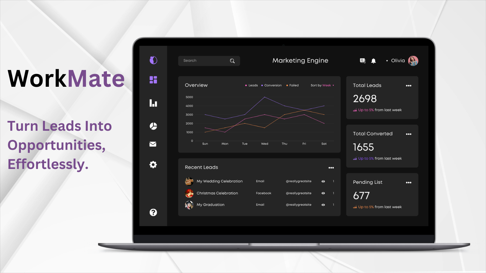

 # Workmate Lead Triage & Management
 
 Workmate helps simplify the inbound lead management process, automating common challenges such as lead enrichment, assignment and prioritization.
 ## Overview
 Workmate Lead Triage simplifies the inbound lead management process, automating common challenges such as lead enrichment, assignment and prioritization.

## Key Features:

- **Automatic email extraction:**  Workmate helps users by extracting and enriching incoming communications with enterprise context (e.g., linking to existing account). This means users spend less time digging through inboxes, more time responding to high-quality leads.

- **Writeback to external sources:**  Workmate's Ontology and connectors orchestrate with systems of record, ensure your existing CRMs including Salesforce, Monday and HubSpot are kept in sync with the latest lead information.

- **Workflow integration:** Seamlessly integrate with other operational workflows, including Marketing Optimization Engine and Next Best Action to continue cultivating leads, establishing a feedback loop to help improve customer engagement with every lead.