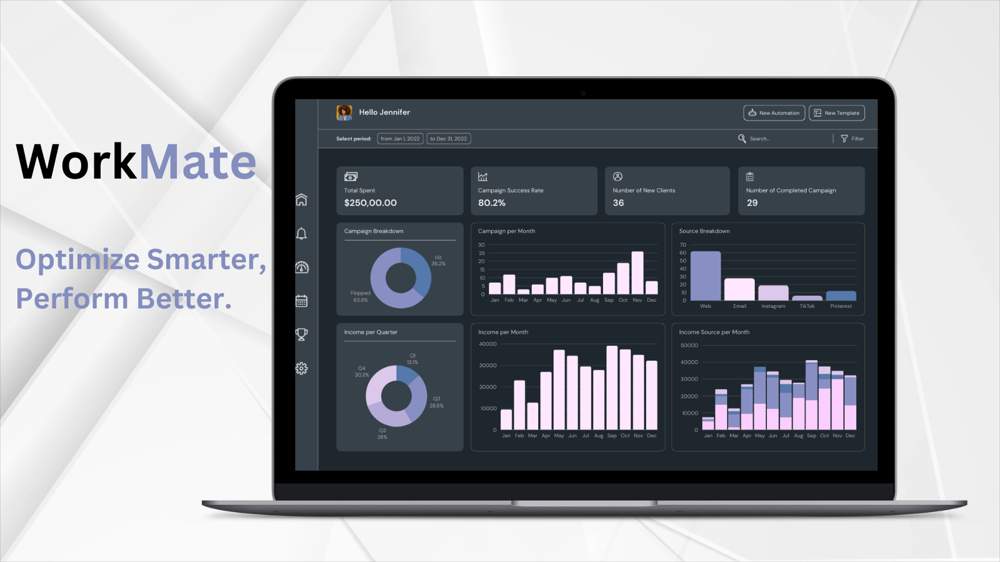

# Workmate for Marketing Campaign Optimization

Workmate helps marketing teams to create, monitor and optimize campaign performance by integrating feedback metrics across multiple sources.

## Overview
Workmate Marketing Optimization Engine helps marketing teams streamline the management and refinement of marketing campaigns by integrating feedback metrics and employing AI to continually enhance campaign performance, with human-in-the-loop feedback and verification.

## Key Features:

- **Live campaign evaluation:** With in-depth A/B testing and granular content management, businesses can achieve sustained campaign improvement - ensuring strategies evolve in alignment with real-world responses and data-driven feedback.

- **Automatically generate and test new ideas:** Workmate empowers marketing teams to configure multiple campaigns against single objectives, to test and evaluate different strategies.

- **Campaign simulation:** Workmate helps marketing teams generate predictions for potential campaign performance by simulating against previous cohorts, campaigns and metrics.