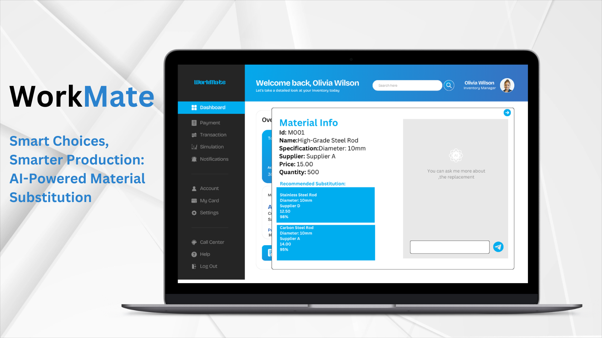

 # Workmate Material Switch Recommendations
 
 Workmate aids users in making quick, informed decisions to meet production demands without compromising quality.
## Overview
 Workmate can harmonize material descriptions from various formats, including PDFs and images.  Workmate assists users with recommendations of alternative parts based on factors like cost, compatibility, and vendor performance. In this way,  Workmate can aid users in making quick, informed decisions to sustain production without having to compromise quality.

## Key Features:

- **Encoded specialized buyer knowledge:**  Workmate allows operators to define natural-language rules, enabling automated identification of similar materials.

- **AI-powered Material Reconciliation:** Interpret schematics and drawings using OCR or vision-based models to extract key features and identify similar materials or substitutions.

- **Buyer Actions Prioritization:** Implement purchasing strategies based on cost and inventory levers. For example, items purchased at different prices from a supplier, or optimizing use of existing inventory instead of purchasing new products.