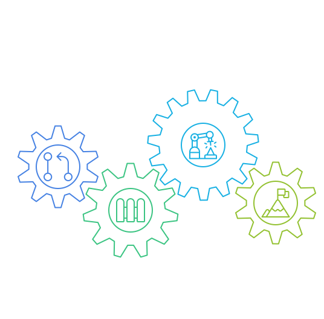
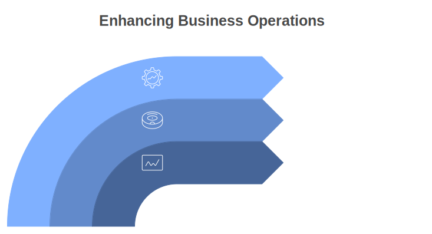

# Workmate Process Optimization Framework

### Workmate Process Optimization empowers organizations to continuously improve processes while establishing automation guardrails alongside AI-powered decision-making.

## Overview

Process Optimization with Workmate empowers organizations to streamline operations, enhance productivity, and potentially reduce operational costs by intelligently automating complex tasks. Using process mining, Workmate proposes improvements and executes actions whilst maintaining human-in-the-loop on complex tasks.

Businesses often struggle with improving processes due to data volume and update frequency making manual scenario testing strenuous and unreliable. Improvement of these processes typically involves complicated business logic that is difficult to encode into software.

Given the large downstream impact of possible process changes, there needs to be accessible and configurable guardrails, granular and traceable audits, and justifications on decisions made.

This application includes components to address common pain points and streamline process optimization efforts — impacting KPIs such as cost, standard time and success rate.

## Key Features:

- **Efficient Process Mining:** Rapidly extract value from logs to uncover hidden inefficiencies, enabling in-depth root cause analysis through interactive visualizations, and providing a customizable and user-friendly process mining experience.
- **Intelligent Task Automation:** Deploy agents to autonomously execute complex tasks and complement human efforts, effectively scaling operations and reducing errors, while allowing employees to focus on more creative and high-impact activities.
- **Continuous Process Improvement:** Analyze logs from various source systems to identify bottlenecks, compute performance metrics, and optimize business processes through data-driven corrective actions.