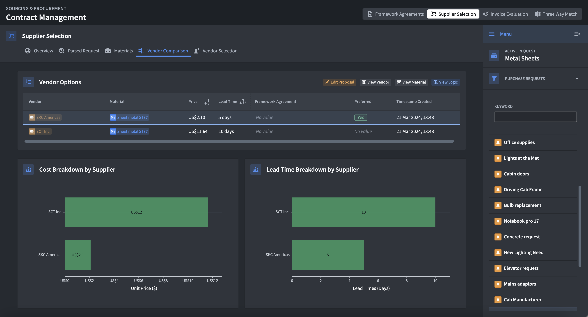

# Workmate Procurement for Construction Projects: Three-Way Matching

Simplify procurement process with an intuitive application designed for construction professionals. Easily manage contracts, surface suggested suppliers, oversee invoice accuracy, and get notified instantly when there are discrepancies in purchase orders, invoices, and goods receipts.
## Overview
Workmate streamlines purchasing workflows, integrating LLMs to effortlessly synthesize extracted information within contracts, recommend suggested suppliers, and ensure that invoices match orders and goods receipts.

Stay ahead with a system that highlights any inconsistencies, allowing teams to manage compliance within given procurement processes.

## Key Features:

- **Contract 360:** Get a clear, AI-powered summary of contracts, transforming complex documents into actionable information.
Smart Supplier Selection: Let AI guide you in suggesting suppliers by analyzing material needs and past purchasing data to suggest the most suitable options.
- **Invoice Monitoring:** Keep finances in check with automatic alerts for invoice discrepancies, overdue payments, minimum order quantity violations and unit price mismatches, improving compliance with contract terms.
- **Three-Way Matching:** Identify discrepancies between the three procurement items (invoice, purchase orders, goods receipts), allowing procurement teams to follow up with suppliers.
