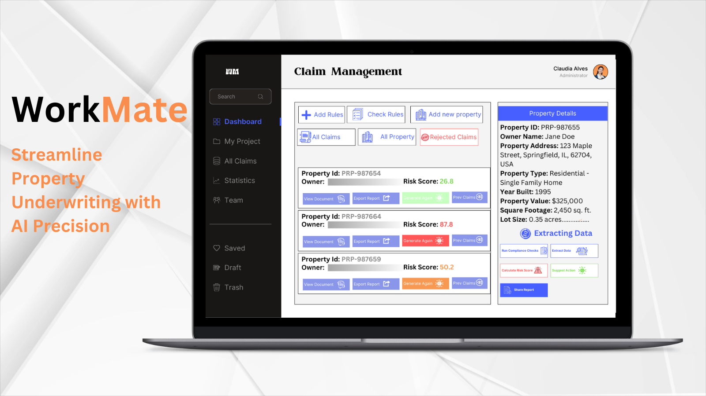
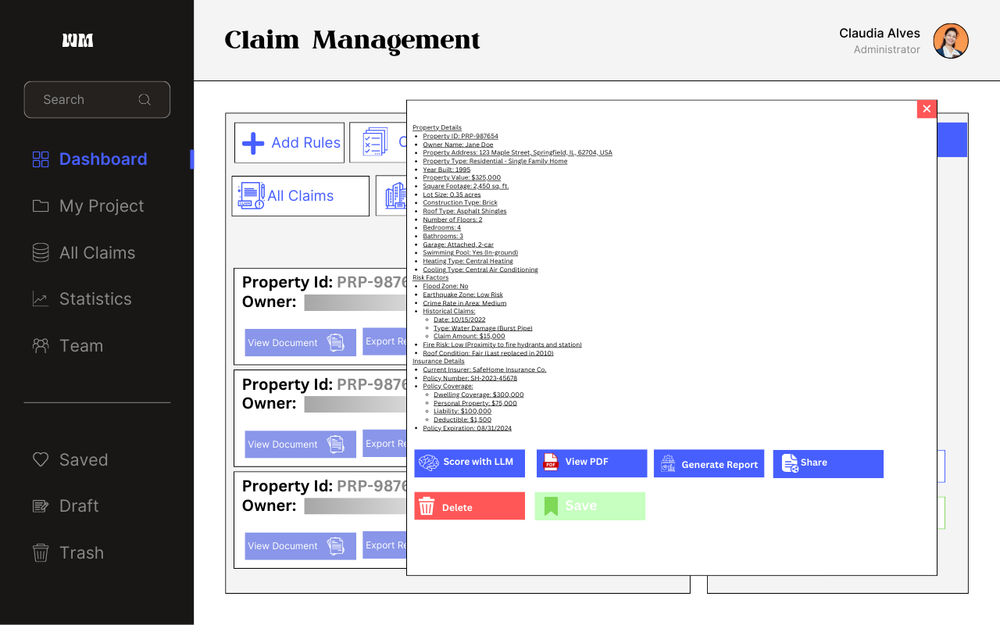

# Workmate Property Insurance Underwriting Assistant

 Workmate helps underwriters analyze insurance submissions by flagging potentially detrimental features and conducting checks for standard compliance.

## Overview
Workmate helps teams extract and organize data from incoming property insurance submissions, enabling underwriters to rapidly make sense of complex risk information, flag potentially detrimental features, and ensure standard compliance in underwriting.

## Key Features:

- Extract relevant data from property insurance submissions and appropriate records while maintaining the necessary sourcing to the underlying documents.

- Automatically detect and flag: Workmate allows organizations to integrate external data sources, such as SEC filings and news articles, to enhance their underwriting process.

- Workmate enables underwriters to generate suggested responses to broker/agent based on a combination of automated flags generated and Human-In-The-Loop interventions.