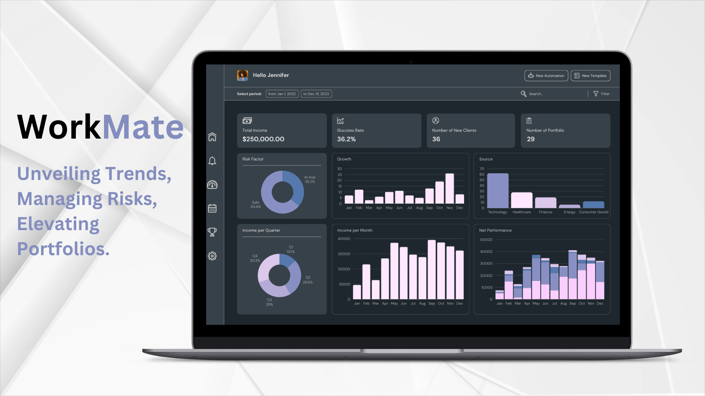
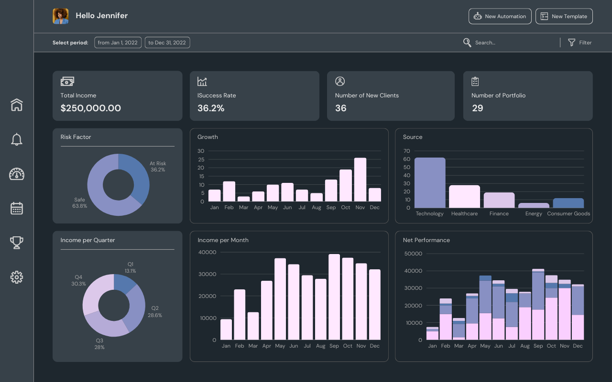

# Workmate for Portfolio Risk Trends & Management

Workmate enhances portfolio management by helping users investigate rate and exposure trends and apply these insights to existing risk portfolios.

## Overview
Workmate enhances portfolio management by helping users investigate rate and exposure trends, and apply these insights on existing risk portfolios.

## Key Features:

- **Granular Portfolio Management:** Analyze performance at every level of portfolio, and against capital allocation, to identify risk and policy volume.

- **Macro Portfolio Management:** Workmate allows users to enhance the Ontology with external public data sources, for example trend information from news articles, industry reports and internal meeting note. This enables portfolio managers to contextualize macro events and trigger portfolio actions.

