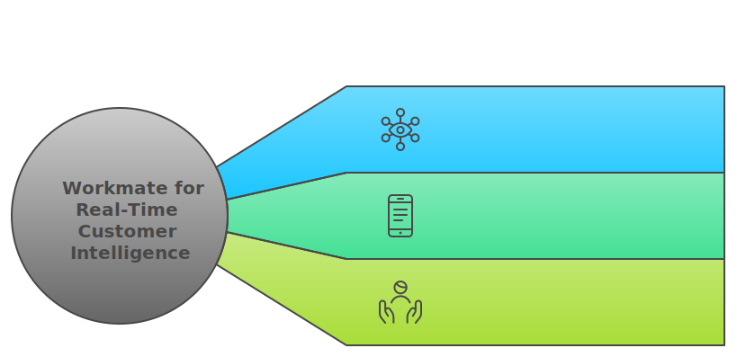
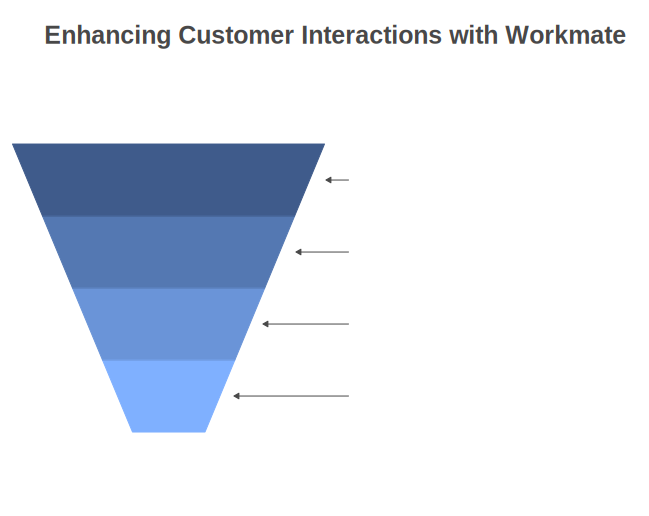

# Workmate for Real-time Customer Intelligence in Banking

Provide best-in-class customer experience for financial clients by using Workmate to arm Relationship Managers and Customer Service Teams with contextually relevant recommendations for next best actions in real-time.
## Overview

Workmate for Real-Time Customer Intelligence equips banking Customer Service Teams and Relationship Managers with the tools to provide best-in-class customer experience. This is achieved by offering hyper-personalized guidance and intelligent suggestions for next best actions during real-time interactions.

Workmate leverages the Ontology to create a contextualized understanding of the customer and their anticipated behavior during live interactions. That way, operators are able to seamlessly suggest most relevant recommendations and data-informed financial guidance based on similar, previous interactions, recommendations and outcomes.

The Ontology evolves with every interaction, ensuring that the suggested guidance is increasingly tailored and pertinent to each customer. As a result, Workmate streamlines the interaction cycle, offering immediate, AI-driven financial guidance and targeted support for Relationship Managers to suggest to clients during live exchanges.

## Key Features:

- **AI-driven Recommendations:** Real-time audio-to-text transcription including intelligence extraction and suggesting hyper-personalized next best actions supporting 50+ languages to facilitate best-in-class customer experience and guidance live.
- **Dynamic Information Capture:** Workmate enables organizations to facilitate automated note taking, customer interaction summaries and customer reactions for further operational usage, analytics and intelligence extraction.
- **Integrated Suite of Configurable Business Rules:** Fully and easily customizable not only within different banking contexts such as retail-, corporate and private banking banking but also for other business functions and industries such as call centers for accelerated incident resolution, insurance for claims management, and many more.

