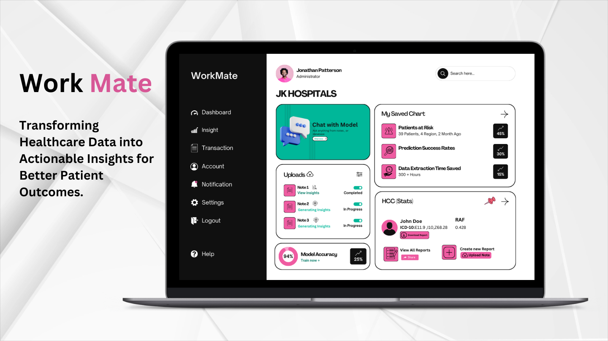
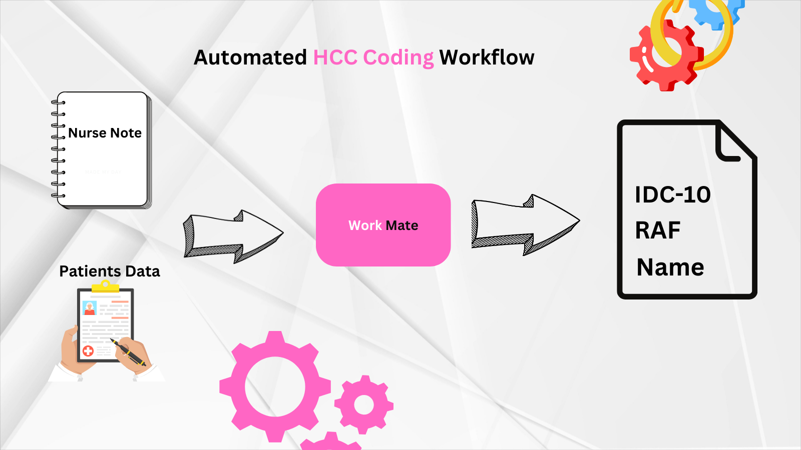
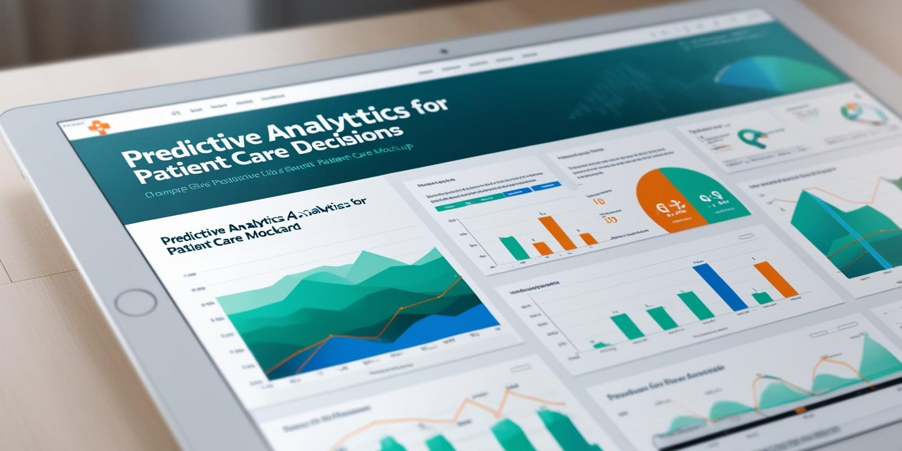
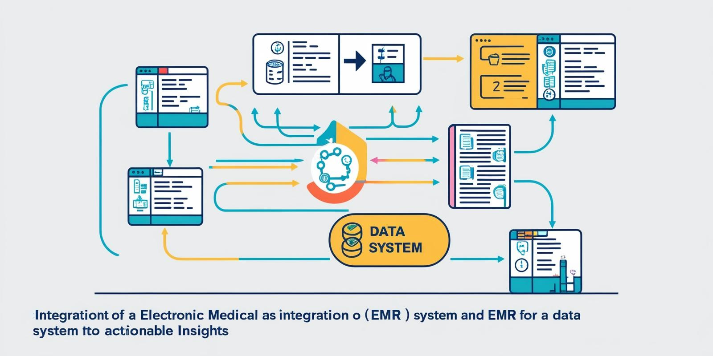

# Revolutionize Patient Care with AI-Powered Data Extraction and Predictive Insights for Healthcare

Our advanced AI platform is designed for healthcare providers to streamline the extraction of critical insights from unstructured clinical notes, such as nurse notes, and automate essential workflows. Whether you’re a large healthcare organization or an SME clinic, our solution empowers medical teams to transform raw clinical data into actionable insights, improving patient outcomes and operational efficiency.

## Use Cases

1. **Automated Patient Risk Adjustment & Medicare HCC Coding**
   >Simplify complex risk adjustment and Hierarchical Condition Category (HCC) coding by automatically extracting essential data from nurse and physician notes. Our AI system identifies relevant information within clinical documentation, ensuring compliance and maximizing accuracy for Medicare HCC coding without manual intervention.
2. **Clinical Decision Support**
   >Equip healthcare teams with real-time decision support by building predictive models on automatically extracted data. With precise insights from unstructured documents, providers can make faster, data-driven decisions that enhance patient care quality and minimize risks.

## Features

- **Automated Data Extraction from Clinical Notes**
  >Leverage generative AI to identify critical details within nurse notes, treatment records, and other unstructured data sources. The platform’s smart extraction technology saves time and ensures relevant information is instantly accessible, reducing manual review efforts and allowing clinicians to focus on patient care.

- **Risk Assessment & Coding Automation**
  >Ensure accurate patient risk adjustment and HCC coding for Medicare by automating data categorization and risk scoring from clinical documentation. Our AI solution aligns with regulatory standards, helping healthcare providers meet compliance requirements with less effort and higher accuracy.

- **Predictive Models for Clinical Decisions**
  >Transform extracted insights into predictive analytics for informed clinical decision-making. With the AI platform’s ability to create models based on real-time data, healthcare teams gain predictive power for areas such as patient deterioration risk and chronic disease management, ultimately enabling proactive care.
- **Seamless Integration Across Systems**
  >Our platform is designed to integrate with existing EMRs and data systems, creating a unified source of truth across clinical documentation, patient records, and operational workflows.

