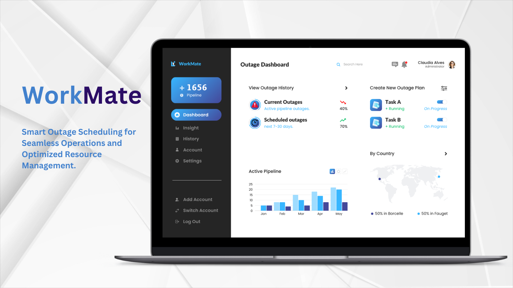
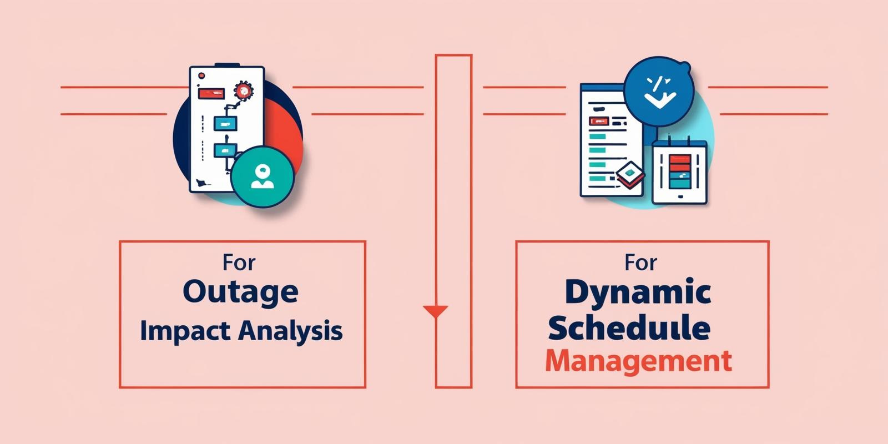

# Smart AI-Powered Pipeline Outage Scheduling for Efficient Resource Management.

---
### Efficiently plan and manage pipeline outages with Workmate, designed to streamline complex operational demands and optimize resource allocation for the energy sector.

With Workmates’s Pipeline Outage Scheduling app, energy companies can navigate the complex planning of pipeline outages with an AI-driven approach, optimizing for minimal disruption to operations and customer impact. This solution allows operations teams to strategically plan outages around seasonal demand, resource availability, and real-time conditions—helping to ensure peak operational efficiency and swift decision-making.

### Overview

Workmate’s Pipeline Outage Scheduling solution empowers operations teams to optimize pipeline outage schedules while balancing the needs of stakeholders and minimizing impact on customers. This tool simplifies complex planning processes, enabling teams to respond dynamically to changing demands and achieve strategic alignment.

### Key Features

1. **Outage Impact Analysis**
   - **Description:** Visualize and analyze customer and operational impact by evaluating outage frequency, flow disruption, financial costs, and resource availability.
2. **Dynamic Schedule Management**
   - **Description:** Manage outage schedules and personnel assignments dynamically, adjusting plans as real-time conditions evolve.
3. **Workmate-Assisted Scheduling and Recommendations**
    - **Description:** Let Workmate assist with scheduling, recommending optimal times for outages based on pipeline capacity, personnel availability, and urgency.
4. **Continuous Performance Evaluation**
   - **Description:** Retrospective analysis of past outages supports strategic planning, enhances responsiveness, and improves future scheduling.
5. **Proactive Schedule Monitoring**
   - **Description:** Notify stakeholders of schedule adjustments, keeping planning teams informed to act on changes swiftly.

### Customer Benefits
- Brief bullets on how Workmate's Pipeline Outage Scheduling minimizes operational disruptions, improves resource allocation, and boosts decision-making efficiency.
