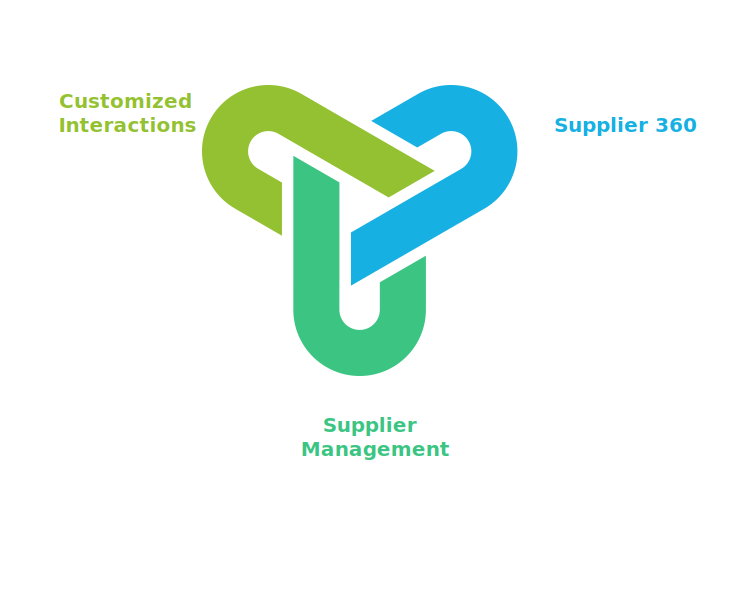

# Workmate for Supplier Management

### Workmate allows operators to enhance both supplier interactions and procurement strategies to foster business growth.

## Overview

Workmate Supplier Management enhances supply chain transparency, operational efficiency, and risk management by providing users with tools to proactively monitor supplier performance and purchase orders. Workmate supports data-informed decision-making, assisting operators, enhancing supplier interactions and procurement strategies to foster business growth.

## Key Features:

- **Supplier 360:** An integrated view of supplier relations, risk assessments, and purchase order management reducing the need for manual collation across these disparate data sources.
- **Supplier Management:** Workmate enables users to leverage enriched statistics and AI-generated risk scores for suppliers and purchase orders, to proactively coordinate with suppliers-at-risk to mitigate business impact.
- **Customized interactions:** The Ontology aligns suppliers and purchase orders with organizational strategy, mitigating manual and complex logic management.

