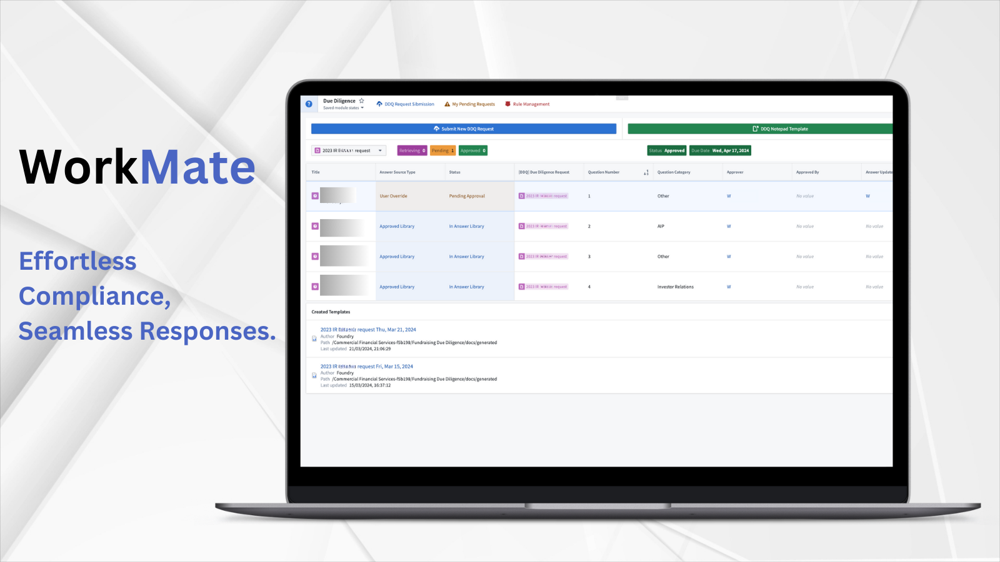

 # Workmate Response with Vision for RFPs/DDQs
 
Enhance efficiency and compliance in managing Due Diligence Questionnaires (DDQ) by automatically drafting responses, leveraging expertise, optimizing communication, and ensuring full transparency and customization in the due diligence process.
## Overview
 Workmate streamlines response generation and sign-off for Inbound Operational Due Diligence requests from Limited Partners. It enables users to swiftly search previous Due Diligence Questionnaire (DDQ) inquiries and the firm's policy documents to craft comprehensive answers. Additionally,  Workmate recommends responses that have already received legal and compliance approval. The integrated process state machine orchestrates a detailed, multi-stage approval workflow, guaranteeing that responses receive the necessary human-in-the-loop confirmation before being finalized.

## Key Features:

- Advanced Ontology Retrieval-Augmented Generation (O-RAG) Implementation: Searches through previous Due Diligence Questionnaire (DDQ) requests and the complete collection of policy documents to generate the most current responses that are legally and compliance-approved for inbound inquiries.

- Fully Customizable Request Categorization Framework: Intelligently designates approvers for individual questions based on their expertise, streamlining the approval process.

- Customizable and Automated Alerting Mechanism: Minimizes email exchanges between request submitters and approvers, ensuring timely responses to inquiries.

- Full Auditability: Provides full insight into the Language Model's (LLM) chain of thought, tool use, response generation, request approvals, and any changes over time to legally approved responses.